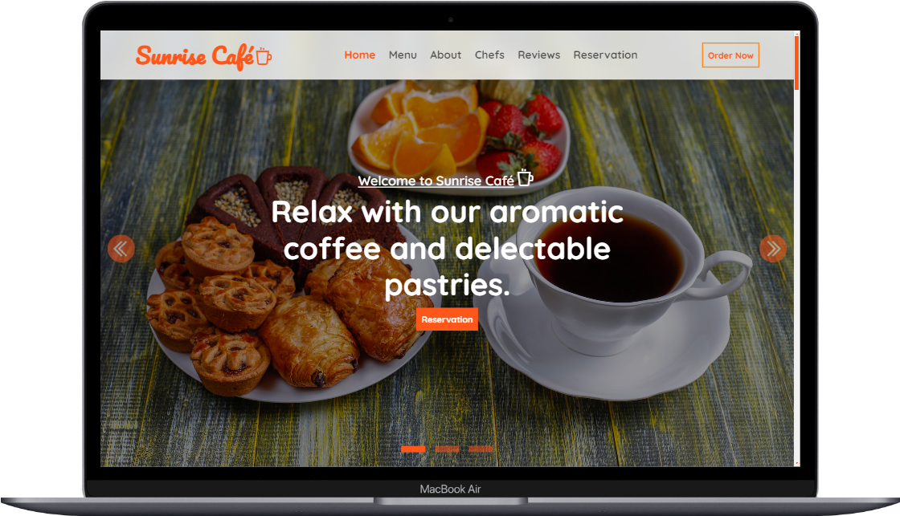

<link rel="stylesheet"
    href="https://maxst.icons8.com/vue-static/landings/line-awesome/line-awesome/1.3.0/css/line-awesome.min.css" />

# Sunrise Café <i class="las la-coffee fs-1"></i>

Welcome to the Sunrise Café <i class="las la-coffee fs-1"></i> website repository! This project showcases a modern, responsive website built using only CSS, Bootstrap 5, and JavaScript. The site features an attractive UI with a vibrant orangered brand color, and includes a slider, amazing menu cards, and a reservation slide. Icons from Icons8 and LineAwesome have been used to enhance the design.

Project Preview: [Here](https://codebyfaisal.github.io/sunrisecafe/)



## Features

- **Responsive Design**: Ensures the website looks great on all devices.
- **Attractive UI**: Sleek and modern design with an orangered brand color.
- **Bootstrap Carousel**: A beautiful slider for the home section.
- **Menu Cards**: Eye-catching menu cards for displaying delicious offerings.
- **Reservation Slide**: A smooth reservation section for booking tables.
- **Icons**: Enhanced with icons from Icons8 and LineAwesome.

## Sections

1. **Home**: A welcoming section featuring a Bootstrap carousel.
2. **Menu**: Displays the café's menu with stunning menu cards.
3. **About**: Learn more about Sunrise Café <i class="las la-coffee fs-1"></i>.
4. **Chefs**: Meet our talented chefs.
5. **Reviews**: See what our customers have to say.
6. **Reservation**: Easily make a reservation.
7. **Instagram Gallery**: A gallery showcasing our latest photos.
8. **Newsletter**: Sign up for our newsletter.

## Technologies Used

- **CSS**
- **Bootstrap 5**
- **JavaScript**
- **LineAwesome** for icons

## Installation

To get a local copy up and running, follow these steps:

1. **Clone the repository**:
    ```sh
    git clone https://github.com/codebyfaisal/sunrisecafe.git
    ```

2. **Open the project directory**:
    ```sh
    cd sunrise-cafe
    ```

3. **Open `index.html` in your browser** to view the website.

## Usage

Feel free to use this project as a template for your own café or restaurant website. Customize the content and design to suit your needs.

## Contributing

Contributions are welcome! If you have suggestions or improvements, please create a pull request or open an issue.

## License

Distributed under the MIT License. See `LICENSE` for more information.

## Contact

Muhammad Faisal - [LinkedIn](https://www.linkedin.com/in/codebyfaisal) - codebyfaisal@gmail.com

---

Thank you for visiting the Sunrise Café <i class="las la-coffee fs-1"></i> repository! Enjoy browsing through our website. 🌅
